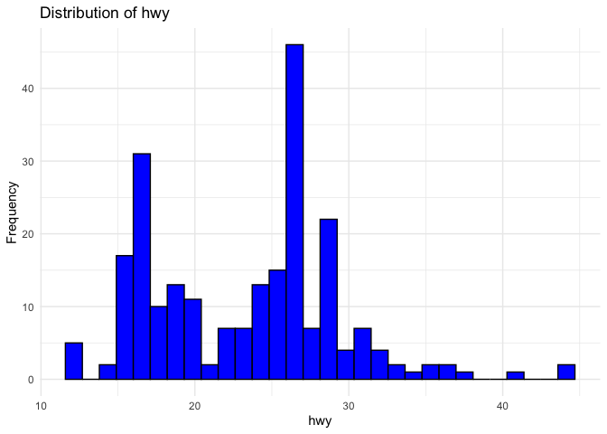

assignment-b1
================

### This assignment covers making a function in R, documenting it, and testing it.

## Setup

First, load the necessary libraries and any datasets required:

``` r
library(dplyr)
```

    ## 
    ## Attaching package: 'dplyr'

    ## The following objects are masked from 'package:stats':
    ## 
    ##     filter, lag

    ## The following objects are masked from 'package:base':
    ## 
    ##     intersect, setdiff, setequal, union

``` r
library(testthat)
```

    ## 
    ## Attaching package: 'testthat'

    ## The following object is masked from 'package:dplyr':
    ## 
    ##     matches

``` r
library(ggplot2)
```

## Exercise 1 & 2: Create and Document a Function

I will design a function called plot_distribution that generates a
histogram for a given numeric column of a dataframe. This function will
help streamline the exploration of data distributions.

Naming Justification: The parameter names data, column, and bins in the
function plot_distribution are selected for their clarity and
explicitness. data indicates the dataframe where the column exists,
column signifies the specific column to be plotted, and bins suggests
the granularity of the histogram.

``` r
#' Plot a Histogram for a Numeric Column
#'
#' This function generates a histogram for a given numeric column within a dataframe.
#' @param data A dataframe containing the data with the numeric column to plot.
#' @param column A character string specifying the numeric column to be visualized.
#' @param bins An integer value indicating the number of bins for the histogram.
#'
#' @return A ggplot histogram object of the specified numeric column.

plot_distribution <- function(data, column, bins = 30) {
  if (!is.data.frame(data)) {
    stop("'data' should be a dataframe.")
  }
  
  if (!is.character(column) || length(column) != 1) {
    stop("'column' should be a single character string naming the numeric column.")
  }
  
  if (!is.numeric(bins) || bins <= 0) {
    stop("'bins' should be a positive integer indicating number of bins in the histogram.")
  }
  
  column_data <- rlang::sym(column)
  
  plot <- data %>%
    ggplot(aes(x = !!column_data)) +
    geom_histogram(bins = bins, fill = "blue", color = "black") +
    labs(title = paste("Distribution of", column), x = column, y = "Frequency") +
    theme_minimal()
  
  return(plot)
}
```

## Exercise 3: Include examples

Example usage of the plot_distribution function with the mpg dataset
from the ggplot2 package:

``` r
# Proper Usage: Plotting distribution of the 'hwy' column
plot_distribution(mpg, "hwy")
```

<!-- -->

Example of incorrect usage:

``` r
# Improper Usage: Non-existent column
plot_distribution(mpg, "highway_mileage")
```

    ## Error in `geom_histogram()`:
    ## ! Problem while computing aesthetics.
    ## ℹ Error occurred in the 1st layer.
    ## Caused by error:
    ## ! object 'highway_mileage' not found

``` r
# Error: 'column' should be a single character string naming the numeric column.

# Improper Usage: Incorrect bins value
plot_distribution(mpg, "hwy", bins = -5)
```

    ## Error in plot_distribution(mpg, "hwy", bins = -5): 'bins' should be a positive integer indicating number of bins in the histogram.

``` r
# Error: 'bins' should be a positive integer indicating number of bins in the histogram.
```

## Exercise 4: Test the Function

Creating tests for the function to verify its correct functionality and
handling of errors:

``` r
test_that("Test plot_distribution function", {
  # Correct Usage
  expect_is(plot_distribution(mpg, "hwy"), "ggplot")
  
  # Non-existent column
  expect_error(plot_distribution(mpg, "highway_mileage"), "'column' should be a single character string naming the numeric column.")
  
  # Incorrect bins value
  expect_error(plot_distribution(mpg, "hwy", bins = -5), "'bins' should be a positive integer indicating number of bins in the histogram.")
  
  # Data is not a dataframe
  expect_error(plot_distribution(list(mpg$hwy), "hwy"), "'data' should be a dataframe.")
  
  # Column is not a string
  expect_error(plot_distribution(mpg, 123), "'column' should be a single character string naming the numeric column.")
})
```

    ## ── Failure ('<text>:6:3'): Test plot_distribution function ─────────────────────
    ## `plot_distribution(mpg, "highway_mileage")` did not throw an error.

    ## Error in `reporter$stop_if_needed()`:
    ## ! Test failed

``` r
# Test passed 😀
```
